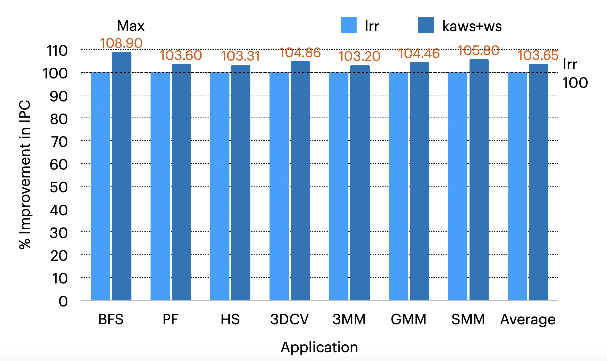

# COA_lab_repo_grp01

## End Semester Project - KAWS and Warp Sharing Mechanism

### Statistics

#### IPC With Warp Sharing

|              | BFS    | PF     | HS      | GMM   | SMM    | 3MM    | 3DCV   | AVG    |
| :----------: | ------ | ------ | ------- | ----- | ------ | ------ | ------ | ------ |
|     KAWS     | 110.43 | 719.89 | 2519.86 | 69.99 | 150.24 | 287.35 | 301.1  | 714.08 |
|     LRR     | 102.34 | 701.64 | 2462.96 | 67.64 | 143.36 | 280.15 | 290.83 | 695.59 |
| % Improvment | 7.9    | 2.6    | 2.31    | 3.46  | 4.8    | 2.5    | 3.53   | 3.871  |

#### IPC Without Warp Sharing

|              | BFS    | PF     | HS      | GMM   | SMM    | 3MM    | 3DCV   | AVG    |
| ------------ | ------ | ------ | ------- | ----- | ------ | ------ | ------ | ------ |
| KAWS         | 101.30 | 700.5  | 2433.78 | 67.3  | 142.80 | 279.05 | 288.73 | 689.14 |
| LRR          | 101.41 | 694.87 | 2439.13 | 67.01 | 142.01 | 278.25 | 287.15 | 688.88 |
| % Improvment | -0.11  | 0.81   | -0.22   | 0.43  | 0.56   | 0.38   | 0.55   | 0.343  |
